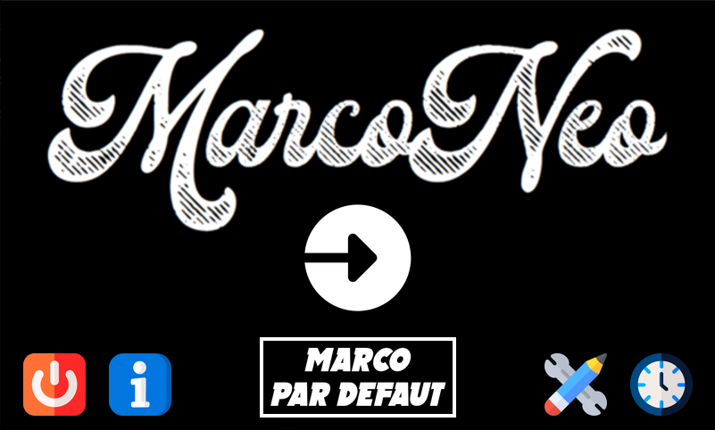
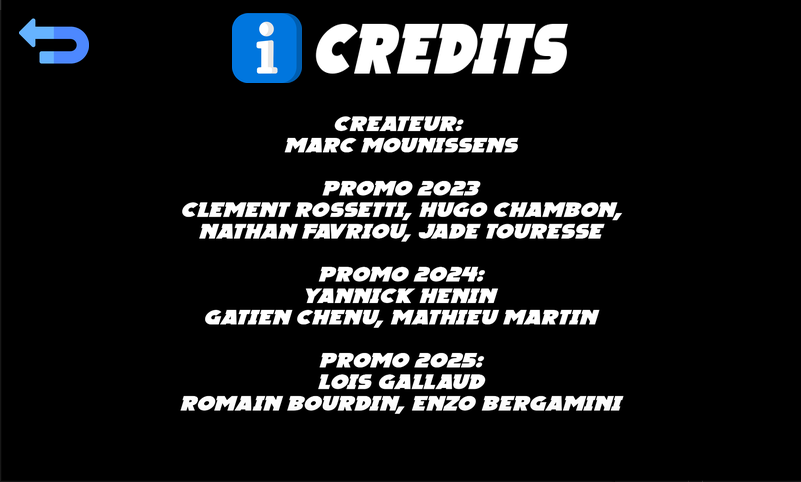
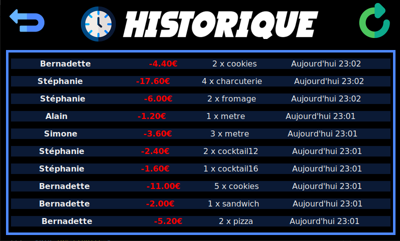
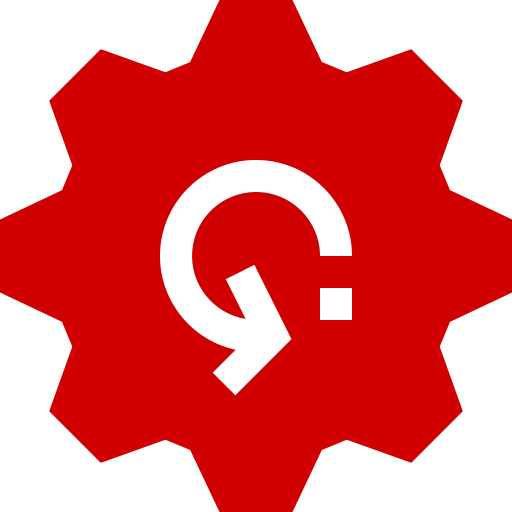
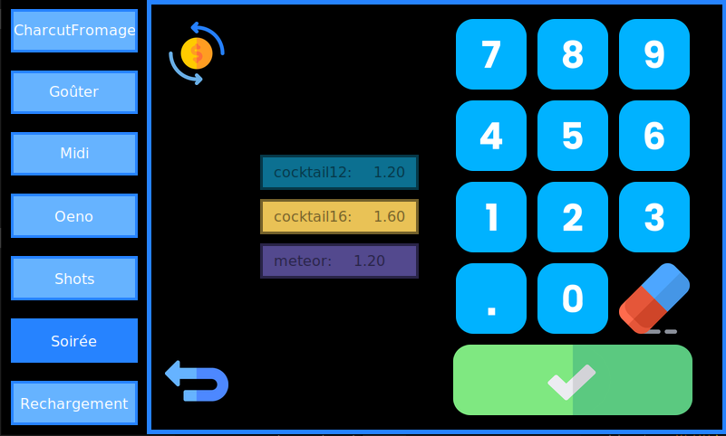

# **MARCONEO**


---

La **Marconeo** est une machine utilisée par les responsables du foyer étudiant (appelés Fouailles) pour faire payer les cotisants au [BDE](https://bde-tps.fr/).

On peut la trouver sous la forme d'une boîte avec un écran tactile.
Cette boîte est souvent nommée "**Marco**" pour les étudiants de [Télécom Physique Strasbourg](https://www.telecom-physique.fr) (abrégé en TPS).

---
<div id="avant-propos">

## ***AVANT-PROPOS***

Ce fichier README a pour but d'aider les fouailles à utiliser la Marco. Il fera office de manuel d'utilisation et de guide d'installation.
</div>

---

<div id="table-des-matieres">

## **TABLE DES MATIERES**

- [**INTRODUCTION**](#introduction)
    - [Qu'est ce que la Marco?](#quest-ce-que-la-marco)
    - [A quoi sert la Marco?](#a-quoi-sert-la-marco)
        - [Qu'est ce que la *Carte Fouaille*?](#quest-ce-que-la-carte-fouaille)

- [**APPLICATION MARCONEO**](#application-marconeo)
    - [Menu principal](#menu-principal)
    - [Crédits](#credits)
    - [Configuration](#configuration)
    - [Historique](#historique)
    - [Achats](#achats)
    - [Rechargements](#rechargements)
    - [Modification de prix](#pricemodifier)

- [**INSTALLATION**](#installation)
    - [Prérequis](#prerequis)
    - [Installation de la Marco](#installation-marco)
</div>

---

<div id="introduction">

## **INTRODUCTION**

<div id="qu-est-ce-que-la-marco">

### **Qu'est ce que la Marco?**

La Marco est le projet ingénieur d'un ancien étudiant de TPS. Au fur et à mesure que les années passent, certains autres étudiants s'y sont intéressé pour l'améliorer ou bien la réparer suite à des dégradations (voir [VERSIONS](#versions) de la Marco). Une boîte a été imprimée en 3D pour pouvoir y contenir les composants nécessaires à son fonctionnement. Son programme est stocké dans une Raspberry pi à l'intérieur de la boîte et fait fonctionner une interface graphique sur l'écran lorsque la Marco est alimentée. Il suffit pour les Fouailles de scanner les Cartes Fouaille des étudiants devant la Marco pour pouvoir déduire de l'argent sur leur solde en intéragissant avec l'interface graphique sur l'écran.

</div>
<div id="a-quoi-sert-la-marco">

### **A quoi sert la Marco?**

Elle permet au BDE **d'opérer des transactions par carte fouaille de manière instantanée**. L'application étant reliée à la base de donnée du BDE, elle permet aux Fouailles et au Trésorier de tenir les comptes du BDE.
Elle peut également servir aux cotisants de consulter **leur solde** (contenu sur leur carte fouaille) et **leur historique d'achats**.

>#### Qu'est ce que la *Carte Fouaille*?

Il s'agit d'une carte en plastique magnétisée qui sert de cagnotte pour les cotisants. Elle leur est remise lors de l'adhésion au BDE en début d'année. Cette carte contient un numéro unique, pouvant être détecté par le capteur RFID de la Marco (principe de la [radio-identification](https://fr.wikipedia.org/wiki/Radio-identification)).

Après avoir été branché en USB au PC, le capteur RFID fonctionne comme un clavier: c'est à dire que lorsqu'une carte est passée devant le capteur, le PC reçoit l'ordre d'écrire des caractères.
Chaque numéro sur les Cartes Fouailles vont de 0 à 10 chiffres mais une Carte Fouaille est **unique**. Si vous la perdez vous ne pourrez plus consommer et utiliser votre solde.

---
---

<div id="application">


## **APPLICATION MARCONEO**

L'application Marconeo est codée en Python et est liée à l'API du BDE ainsi qu'à la base de donnée du BDE. Elle permet de faire fonctionner la Marco et de gérer les transactions d'argent.

---

<div id="menu-principal">

- ***Menu principal :***

    


    Le menu principal présente plusieurs boutons:
    -  : permet d'allumer ou d'éteindre la Marco. **Il est préférable d'éteindre la Marco avec ce bouton plutôt que de la débrancher** car les déconnexions aux serveurs se font proprement en plus de prendre soin du matériel.

    -  : permet d'accéder aux crédits et aux contributeurs du projet.

    -   : permet de voir la configuration actuelle de la Marco.

    -  : permet de modifier les items disponiles à l'achat sur la Marco.

    -  : permet d'accéder à l'historique des transactions de la Marco.

</div>
<div id="credits">

- ***Crédits :***

    Le menu crédits permet à l'utilisateur de voir les différents contributeurs au projet.

    
</div>
<div id="historique">

- ***Historique :***

    Le menu historique permet à l'utilisateur de voir les dernières transactions effectuées sur la Marco.

    
</div>

<div id="customisation">

- ***Customisation :***

    Le menu de customisation permet à l'utilisateur de modifier les items disponibles à l'achat sur la Marco. Ces items sont stockés dans un fichier JSON qui est lu par l'application. Il recense tous les produits que les Fouailles décide d'ajouter sur l'interface web mise à leur disposition. Ainsi le but de ce menu est de permettre aux Fouailles de choisir les items qu'ils souhaitent voir apparaître sur l'interface de la Marco tout au long de leur utilisation.

    L'utilisateur peut sélectionner les items qu'il souhaite voir apparaître sur l'interface de la Marco en cliquant sur les cases. Un item est sélectionné lorsqu'il est vert, sinon il est rouge.

    Deux boutons sont disponibles en haut de l'écran:
    -  : permet de rafraîchir les items dans le menu de customisation. Cela permet de voir les modifications apportées par les Fouailles sur l'interface web lorsqu'ils sont déjà en train d'utiliser la Marco.
    -  : permet de remettre à zéro les items sélectionnés. Tous les items sont désélectionnés.

</div>

<div id="achats">

- ***Achats :***

    Ce menu est le menu sur lequel l'utilisateur passe le plus de temps. Il permet de faire des achats sur la Marco. Lorsqu'il arrive sur ce menu, il doit scanner sa carte fouaille pour pouvoir procéder à un achat.
    L'utilisateur a face à lui différents articles disponibles, qui dépendent du type de produit sélectionné dans la bar de navigation à gauche.

    **Sélection d'un produit :**

    - Lorsqu'une carte est scannée, le prénom, le nom et solde de l'utilisateur est affiché en haut de l'écran. L'utilisateur peut alors choisir les articles qu'il souhaite acheter en cliquant sur les boutons correspondants. En cliquant plusieurs fois sur un bouton, l'utilisateur peut choisir la quantité de l'article qu'il souhaite acheter.

    **Annuler une selection :** 

    - Lorsque l'utilisateur a sélectionné un article, il peut toujours annuler son choix en cliquant sur le bouton "supprimer" en bas à gauche de l'écran. Cela annule la sélection de l'article et remet le compteur de quantité à 0.

    **Valider une commande :** 

    - Une fois qu'il souhaite payer sa commande, il doit cliquer sur le bouton "confirmer" en bas à droite de l'écran.
    Un texte de validation s'affiche à l'écran résumant la somme qui sera débité à l'utilisateur connecté au moment de la transaction. S'il le souhaite, il peut toujours faire marche-arrière et annuler sa commande. S'il annule la commande, la page reviendra sur le menu d'achat avec les différents articles disponibles. Sinon, le montant est déduit.

    **Déconnecter un utilisateur :** 

    - L'utilisateur peut déconnecter à tout moment la personne connectée en cliquant sur le bouton "déconnexion" en haut à droite de l'écran. Cela permet de déconnecter l'utilisateur et de revenir sur le menu d'achat avec les différents articles disponibles.

</div>
<div id="rechargements">

- ***Rechargements :***

    - Pour recharger une carte fouaille, il suffit de cliquer sur "Rechargement" dans la barre de navigation à gauche. L'utilisateur doit alors scanner une carte fouaille admin pour pouvoir procéder à un rechargement. Une fois la carte scannée, l'utilisateur peut choisir le montant qu'il souhaite recharger sur la carte fouaille. Il peut choisir entre 1€, 5€, 10€, 20€ et 50€. Une fois le montant choisi, il peut cliquer sur le bouton "confirmer" pour valider le rechargement. Un texte de validation s'affiche à l'écran résumant le montant qui sera crédité à la carte fouaille. S'il le souhaite, il peut toujours faire marche-arrière et annuler le rechargement. S'il annule le rechargement, la page reviendra sur le menu de rechargement. Sinon, le montant est crédité.
</div>

<div id="pricemodifier">

- ***Modification de prix :*** 

    - Il possible de modifier le prix d'un article en cliquant sur "Modification de prix" en haut de l'écran. L'utilisateur peut choisir l'article dont il souhaite modifier le prix en cliquant sur le bouton correspondant. Il peut alors entrer le nouveau prix grâce au pad numérique. Il peut supprimer le prix actuel, remettre les prix par défaut ou valider le nouveau prix. Une fois le nouveau prix validé, le prix est modifié de manière temporaire. A la prochaine utilisation de la Marco, le prix modifié sera oublié.

    
</div>
</div>

---

<div id="installation">


## **INSTALLATION**

<div id="prerequis">

### **Prérequis**

Vous aurez besoin de [Docker](https://docs.docker.com/get-docker/). Allez sur leur site pour télécharger Docker. puis verifiez que Docker est bien installé en tapant la commande suivante dans un terminal:

```bash
docker --version
```

Si vous avez une erreur, c'est que **Docker n'est pas installé**. Si vous avez une version de Docker, c'est que vous êtes **prêt** à continuer.

Grâce à Docker, vous n'aurez pas besoin d'installer Python sur votre machine. Vous n'aurez qu'à suivre les prochaines étapes.

</div>
<div id="installation-marco">

### **Installation de la Marco**

1. Télécharger l'archive du projet sur le [dépôt GitHub](https://github.com/LOISGALLAUD/MarcoNeo)
2. Décompresser l'archive
3. Ouvrir un terminal dans le dossier décompressé
4. Executer les commandes suivantes:

    ```bash
    docker build -t marconeo .
    docker run -it marconeo
    ```

>Que font ces commandes?

- `docker build -t marconeo .` : Construit l'image Docker à partir du fichier `Dockerfile` présent dans le dossier courant. L'option `-t` permet de donner un nom à l'image docker. Ici, on donne le nom `marconeo` à l'image.
- `docker run -it marconeo` : Lance un conteneur à partir de l'image `marconeo`. L'option `-it` permet de lancer le conteneur en mode interactif. Cela permet de voir les logs de l'application dans le terminal. Cette commande execute le fichier `main.py` qui lance l'application.

Pour plus d'informations sur Docker, vous pouvez consulter la [documentation officielle](https://docs.docker.com/) de Docker.

</div>
</div>

---

## **VERSIONS**

| Version | Participants |
| ------- | ------------ |
| Créateur | Marc Mounissens (Promo 2017) |
| V0.2.0 & V0.3.0 | Clément Rossetti (Promo 2022) |
| V0.4.1 | Hugo Chambon (Fouaille BDE 2021), Nathan Favriou (Président Ensorceliste), Jade Touresse (Fouaille BDE 2021) |
| V0.4.2 | Yannick Hénin (Ext BDE 2022) |
| V0.4.3 & V0.4.4 | Gatien Chenu (Int BDE 2022), Mathieu Martin (Ext BDE 2022) |
| V0.5.0 | Loïs Gallaud (Tech Prélistoire) |
| V1.0| Loïs Gallaud (Tech Prélistoire), Enzo Bergamini (Tech BDE 2023), Romain Bourdin (Secrétaire ITS 2023)|

---
---

Rédigé en Juin 2023 par Loïs Gallaud
